## Abstract

Platforms provide the tools necessary for organizations to deliver under increased speed and safety expectations. Historically, internal tooling was offered through either scaling a centralized team or autonomous individual teams. While centralization reduces duplication of effort across an organization, purely scaling a single group often trades short-term relief for long-term limitations.

This paper proposes a platform marketplace model as an alternative where domain experts contribute and operate capabilities independently, while a thin platform layer keeps them discoverable, composable, and governable. Going beyond simple definition, this paper introduces a participation contract that makes this model viable, along with balancing principles that both platform and capability must adhere to for shared benefit. Finally, this paper provides platforms with five testable capability factors that can be used to determine whether a capability can participate in a centralized marketplace safely at scale.

## Limitations of a Centralized Platform Group

The [CNCF Platforms White Paper]() explains that platforms provide users with on-demand capabilities that meet organizational requirements while delivering business value. However, it says little about how the architecture that implements those capabilities can alternatively enable or constrain both initial growth and long-term scale.

Many organizations have responded to growing platform demand by growing a centralized platform group. That can relieve backlog pressure in the short term, but this strategy makes the assumption that a single group of generalists is the right place to scale all capabilities that a platform offers. In practice, this assumption often turns out to be limiting.

As a platform scales, its demand grows in variety as well as in volume. It needs both more capabilities and richer capabilities, and each capability may have its own domain conventions and subject matter experts. A centralized platform group can hire to meet growing volume, but often struggles to enable domain experts without burdening them with the broader platform-building.

Consider an organization where a security team knows secrets management best and a data team knows stream processing best. Both teams want to offer managed capabilities to other teams in the organization. In a centralized model, both must route their work through centralized codebases and centralized processes for integration. As a result, either the centralized platform group owns long-term support for these new capabilities (even without the right expertise), or the experts struggle to support them due to the overhead of coordination.

And there is a deeper cost: when integration is hard, or when specialist teams have doubts about the ability of a centralized model to meet their standards for quality or delivery speed, teams stop contributing, or actively push against adoption. They build outside the platform, or reinvent the capability within their own domain boundaries. Either way, the organization's operational burden increases.

A scaled centralized platform model often results in:

- operational load inefficiencies due to incompatible capability contracts (fragmentation)
- inconsistent user experience
- duplicated effort due to shadow building of competing solutions
- slow response to changing compliance expectations, security requirements, and user requests

<figure align="center">
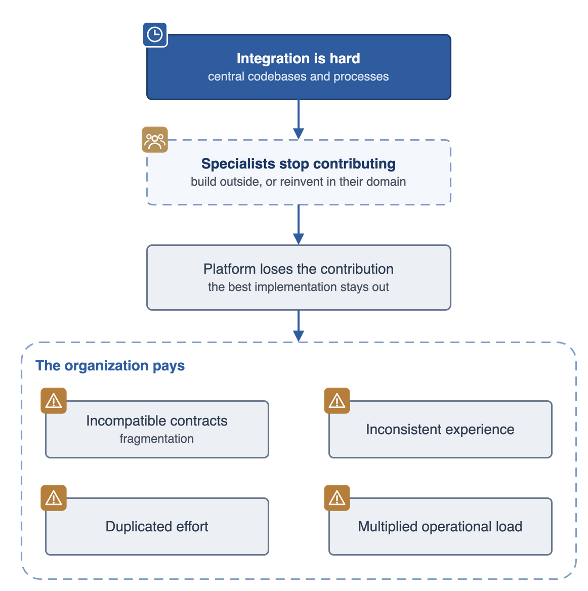
 
<figcaption align="center"><em>When integration is hard, specialists stop contributing and the platform loses the contribution, leaving the organization to pay for fragmentation, inconsistent experience, duplicated effort, and multiplied operational load.</em></figcaption>
</figure>
 

A platform that operates as a capability marketplace solves these problems by defining a clear contribution model that enables capability producers to discover and build upon other teams' work, while sharing operational responsibilities appropriately across teams.

The question is not whether a centralized platform team can build high-quality capabilities, but whether a single team is able to maintain and expand a platform to suit its end users, and to keep pace with the needs of those users as the organization's needs increase. As organizations grow, expertise and needs naturally spread across teams. Requiring capability contributions and updates to pass through a single team makes the platform difficult to grow, slower to improve, and less able to incorporate the best solutions from across the organization.

## The Role of the Centralized Platform Group

Despite the challenges with overcentralization of platform building, a level of centralized tooling is still useful for maintaining a coherent experience. This leads to the temptation to treat fragmentation, user experience, and operational load as a single tooling gap, and to believe that choosing the single right platform technology or buying a specific vendor solution will solve these challenges. Choosing any product or technology requires making a trade-off decision between flexibility and usability ([cognitive load]()). More opinionated platforms trade flexibility for simplified usability over a smaller set of use-cases. Less opinionated platforms trade onboarding complexity for greater flexibility over a broader set of use-cases.

[Platform engineering]() is the creation of an opinionated platform for a specific organization. An un-opinionated internal platform is effectively the same as giving consumers direct access to a public cloud console but with less community or support. Once an organization makes the decision to invest in an internal platform, choosing vendors or tech stacks becomes a matter of compatibility: does the solution allow the blend of flexibility vs cognitive load the organization requires.

Challenges with centralised group platform management are not limited to large organizations with multiple platform teams. They can show up wherever:

- the technology stack is diverse
- the number of resources under management per capability is high
- capability expertise is scattered across teams

The problem may be more visible in larger organizations, but there is value in addressing it across organizations of all sizes.

## A Marketplace Model Supporting Platform Capabilities

An alternative to a centralized platform model is an architecture that lets teams with domain expertise contribute and maintain capabilities independently, without the organization losing coherency or operability. The CNCF Platforms White Paper points in this direction, stating that the platform should be "the thinnest reasonable layer that provides consistency across provided implementations and meets an organization's requirements". Managed products or other internal teams can maintain the implementations, while the platform team's job is to keep those implementations consistent, compliant, and governable.

Two familiar software architectures show how this can work in practice:

- **Plugin systems** keep independent contributions consistent by using a shared framework or contracts.
- **Microservices architectures** let teams ship contributions independently, without a shared language or codebase.

A platform designed to avoid the centralized bottleneck can use ideas from both of these existing, popular designs. A **platform marketplace model** offers a centralized platform where teams with subject matter expertise can contribute and operate capabilities, and where teams that need to leverage capabilities can discover and use them in a self-service manner.

<figure align="center">
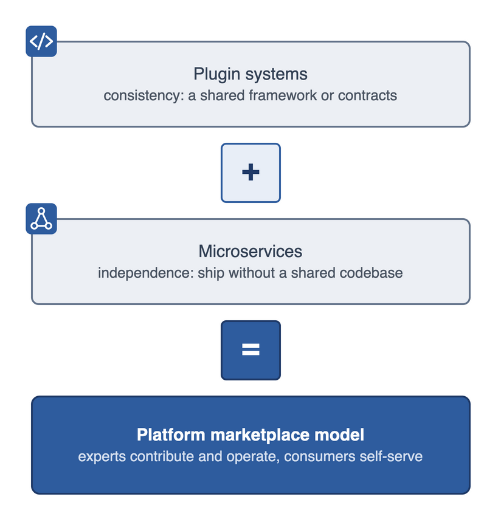
 
<figcaption align="center"><em>The platform marketplace model combines the consistency of plugin systems with the independence of microservices architectures: experts contribute and operate capabilities, consumers self-serve.</em></figcaption>
</figure>
 

The platform marketplace model complements the [Platform Engineering Maturity Model]() by supporting the behaviors of an operational platform into the scaling and optimizing phases.

A capability is the unit of participation in a platform marketplace model. The [CNCF Platforms Glossary]() defines a **capability** as *a user outcome provided by the platform*. This document further specifies that a capability should strive to be **a self-contained service with a defined API, a managed lifecycle, which operates within the platform's participation contract**. Consumers request instances of a capability and depend on those managed instances over time. As noted in the Platform Glossary, a capability delivers an *outcome*. Consumers aren't entirely passive in the lifecycle of a capability. They may participate in a shared responsibility model, being informed or even responsible for some lifecycle activities.

> A **factor-compliant capability** is defined as a user outcome provided by the platform, offered as a self-contained service with a defined API and a managed lifecycle, which operates within the platform's participation contract.

A good capability deliberately encapsulates a domain by providing a clear boundary that hides unnecessary complexity from consumers while exposing relevant configuration choices. Thoughtful encapsulation and product sense expose a complex domain into a platform capability that a consumer can use without needing to become an expert first. As with any abstraction, the value comes from what it chooses not to expose. For example, implementing OpenTelemetry doesn't need direct expertise in the format of spans or how to export data; that is encapsulated within the choice of the language SDK. The same logic can be applied to a platform capability. It is the choice of the capability producer to consider how complex, or simple, their API surface needs to be in order to enable the use cases required by their consumers.

Three main roles emerge in a healthy platform marketplace that maps onto to the "[capability provider]()", "[platform user]()", and "[platform team]()" roles described in the CNCF Platforms Glossary:

- **Capability producers** are the specialist teams who build, contribute, and maintain capabilities, and they are accountable for satisfying the factors described below.
- **Capability consumers** are the teams that request and use capabilities in the platform.
- **Platform operators** own and run the core platform infrastructure through which capabilities are discovered, composed, and governed, and they build the guardrails that make the conformant path the easy path.

<figure align="center">
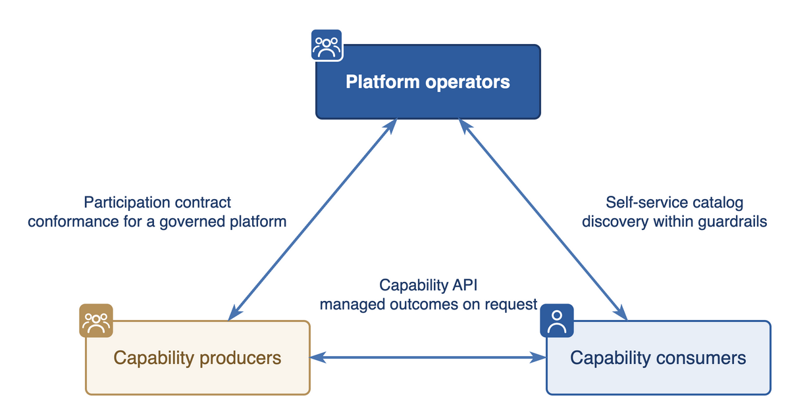
 
<figcaption align="center"><em>Capability producers and capability consumers exchange managed outcomes on request; platform operators govern the exchange through the participation contract and offer a self-service catalog.</em></figcaption>
</figure>
 

<figure align="center">
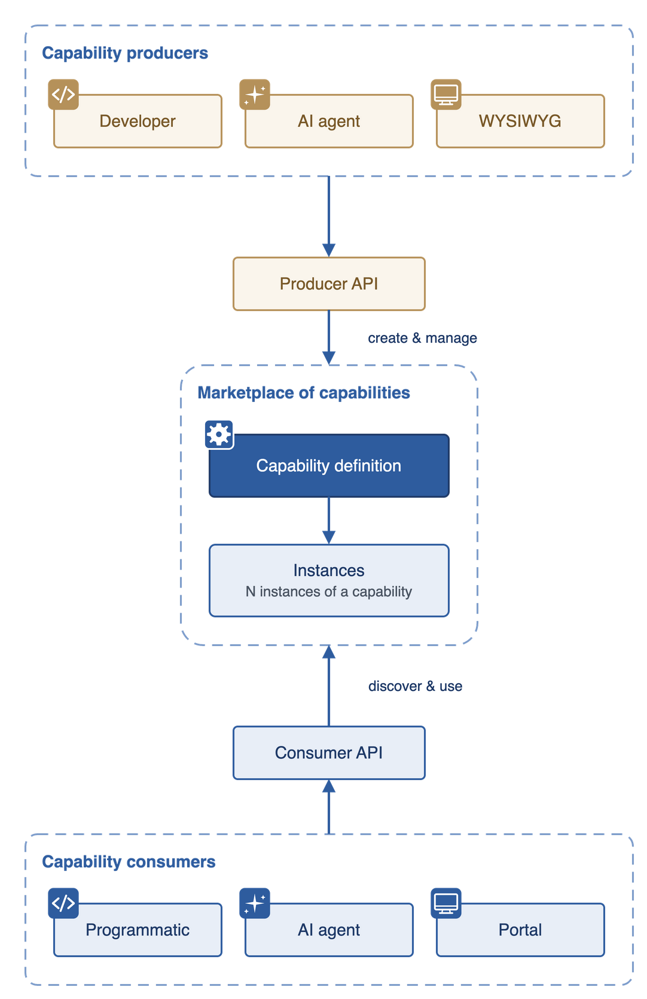
 
<figcaption align="center"><em>Capability producers create and manage capability definitions through a producer API; capability consumers discover and use instances of those capabilities through a consumer API.</em></figcaption>
</figure>
 

## The Platform Participation Contract

Managing the integration between capability producers, consumers and platform operators requires a different model - the platform marketplace model - that can

- quickly adapt to changes in capability needs,
- build a trusted economy-of-scale on shared capabilities,
- operate a breadth of capabilities sustainably.

This relationship creates a type of marketplace that runs on a clear exchange of value between the platform and its producers. Platform teams can implement guardrails to enable producers and consumers to act autonomously within the platform marketplace. A platform team may publish and promote capabilities within the platform themselves. However, in this model they are not a central bottleneck through which every capability must pass.

Without a shared contract, capability producers have no target to design toward, and platform operators cannot govern and catalog what has been added in a consistent way. The participation contract is the agreement that makes this model viable.

{}
In this paper, the term "contract" specifically means this platform-to-producer agreement. We use the separate term "API" to refer to the technical interface that a capability exposes to its consumers.
{}

### Platform Principles

This shared participation contract involves two sides: the capability and the platform. The capability adheres to the contract, while the platform commits to support the capability by following six core operating principles:

**Extensible**

Capabilities are onboarded, updated, and retired through a contract exposed by self-service APIs. Contributing a capability to the platform does not require wider platform redesign, central intervention, or platform-specific implementation tooling. Migration of existing capabilities to the platform model follows the same pattern.

**Composable**

Capabilities can be combined into higher-level platform compositions through shared interfaces. Producers can compose capabilities into those higher-level compositions without consumer effort, without translating between incompatible models, and without depending on hidden internals.

**Declarative**

The platform interactions are expressed as desired outcomes through well-defined contracts rather than through implementation steps, so that what should be true can be described once in a consistent and predictable format, and can then be reconciled over time regardless of producer implementation choice.

**Governable**

Policy, security, and compliance requirements that can be defined centrally are applied consistently across capabilities, and they are updated, maintained and enforced over time without manual intervention.

**Observable**

Capabilities are discoverable and producers are given tools to expose understandable and operable lifecycles both for themselves and their users. All three platform roles can answer their operational questions without needing privileged access or custom reporting.

**Stable**

Making changes to the platform or its capabilities over time can be done safely without breaking existing consumers, because changes are versioned and adopted through a managed roll-out process rather than through forced or manual coordination.

### Capability Principles

For platforms to uphold their principles, each contributed capability must embody three principles of their own:

**Product-scoped**

Capabilities deliver a complete, coherent outcome that can be offered and improved as a product over time. A capability is product-scoped only if consumers can get value without managing internal dependencies or coordinating across hidden teams and systems and receiving updates as the product improves. A capability does not need to have been built in-house to be product-scoped.

**Self-service**

Capability consumers can discover, request, manage, and retire instances on demand, through an API, without specialist knowledge or manual intervention from the capability producer.

**Operationally owned**

The capability producer keeps accountability for the managed aspects of the capability within a clear shared-ownership boundary, and capability consumers clearly understand which operational responsibilities are theirs.

### Why both platform and capability principles matter

Both sides of the contract are needed. A contract that only specifies the obligations that capabilities must satisfy offers no benefits to the capability producers. A contract of platform promises alone guarantees more to capability consumers than any platform can reliably deliver. The capability needs a governed, discoverable, composable platform to host it, while the platform needs capabilities that it can offer without taking on an unsustainable operational load.

<figure align="center">
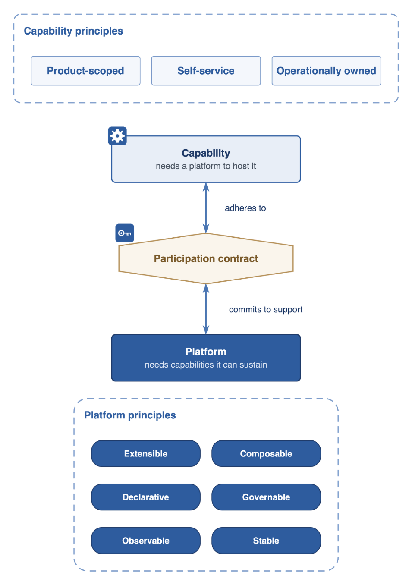
 
<figcaption align="center"><em>Capability principles and platform principles meet at the participation contract: the capability adheres to it, and the platform commits to support it.</em></figcaption>
</figure>
 

## Capability Factors

The factors are the testable specification of the capability side of the contract. Each factor defines a concrete property that maps to one or more of the three capability principles. They share the spirit of [The Twelve-Factor App](https://12factor.net/) by defining conformance criteria. Each criteria builds ideal practices for a capability to integrate easily with the platform with a definite "pass" or "fail". A platform may determine where to set its own standards and whether partial conformance is acceptable here, but each factor names a concrete cost that someone must absorb when it's not met.

1. **Defined Contract** — *The capability exposes a single, versioned, stable contract to consumers.*
1. **Declarative Inputs** — *The capability's API expresses expected outcomes, not implementation steps.*
1. **Encapsulated Dependencies** — *The capability owns what it needs to deliver its outcome.*
1. **Safe Reconciliation** — *The same desired state can be applied repeatedly without side effects.*
1. **Operational Evidence** — *The capability exposes authoritative details about its own state.*

One rule decides what counts as a factor: a property qualifies as a factor when its absence pushes an otherwise-avoidable cost onto the platform team or onto other teams, and when it is not already implied by another factor. If nothing goes wrong when the property is missing, it's not a factor. Simply adhering to all factors does not automatically result in a useful capability, but it allows the producer to iterate on that capability until it becomes useful.

<figure align="center">
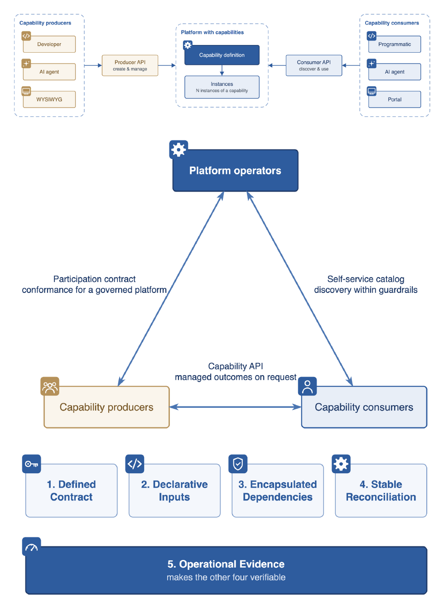
 
<figcaption align="center"><em>The five capability factors. Operational Evidence is what makes the other four verifiable.</em></figcaption>
</figure>
 

### Defined Contract

*The capability exposes a single, versioned, stable contract for consumer access.*

A capability must define one API through which consumers provision, configure, update, observe, and delete their instances, without needing to know how the capability is built. Behind that API, producers are free to choose and change languages, runtimes, infrastructure, and automation, and to evolve those choices over time. The API carries a stable identifier, and if the contract changes, producers should publish a new version rather than mutate the existing one, so that consumers are not broken by a change they did not request.

Whatever sits above the API (for example, a command-line tool, a [web portal](), an AI agent, an internal developer portal) is an interface choice, not a capability requirement. The same holds true across application environments - the API surface does not change just because the capability is deployed somewhere new, and environment-specific configuration is expressed as ordinary inputs to the same contract or is calculated by the capability itself, not through a separate interface.

This is what makes self-service work at scale. The contract simply defines inputs and output ensuring a consumer does not need to coordinate with the producer, learn a capability's implementation details, or discover additional entry points in order to use the capability.

Note that access to capabilities is not the same as access to the resulting services. When a capability provides a running service that has its own interaction modes, e.g. a database with a connection string, consumers will use the service directly and only manage configuration of the service request through the platform.

<figure align="center">
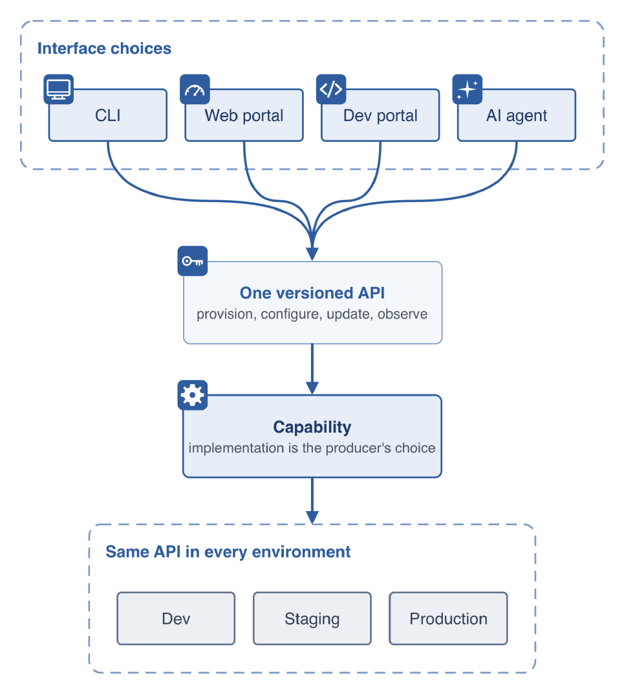
 
<figcaption align="center"><em>Whichever interface a producer or consumer chooses, all of them route through one versioned API that provisions, configures, updates, and observes the capability, consistently in every environment.</em></figcaption>
</figure>
 

#### Conformance tests for Defined Contract

A capability satisfies this factor when all consumer interactions go through a single, versioned, capability-defined API, and consumers can provision, configure, and observe instances without knowledge of the implementation. Consumers do not operate supporting tooling, hold implementation state, or use a separate interface to reach a working outcome. Changes the producer makes behind the API do not change how consumers interact with it.

The cost of failing this factor is that consumers must discover and learn to use capability-specific entry points outside the shared model. Beyond individual cost, every additional entry point is a place the platform cannot see, cannot govern, and cannot easily compose with anything else.

### Declarative Inputs

*The API expresses expected outcomes, not implementation steps.*

A consumer declares their desired state, and the capability owns the translation of that declaration into whatever actions, resources, and ordering are required to reach it.

A request for a database might describe properties such as engine, size, durability, and backup policy, and does not need to include instructions for provisioning steps, dependency ordering, or recovery procedures. The consumer states what should be true; the producer remains responsible for making it true and the platform orchestration keeps it true. Imperative inputs violate this goal. The moment a consumer has to know which steps to run, in what order, or with which dependencies, implementation obligations have moved back onto the consumer, and the capability is no longer meaningfully self-service.

Declared state does more than merely describe the input that starts a process, it also describes what must remain true over time. This unlocks the platform to manage ongoing reconciliation: the capability can keep acting toward the declared outcome as conditions change, rather than depending on the consumer to resubmit a procedure whenever something drifts. This matters most for long-lived capabilities and for capabilities that others depend on.

<figure align="center">
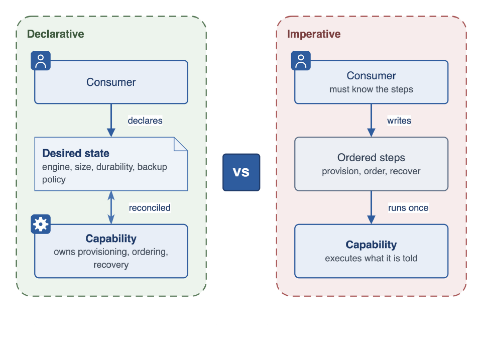
 
<figcaption align="center"><em>Declarative: the consumer declares desired state and the capability owns provisioning, ordering, and recovery. Imperative: the consumer must know and run the steps themselves.</em></figcaption>
</figure>
 

#### Conformance tests for Declarative Inputs

A capability satisfies this factor when it allows consumers to describe their intended outcome in terms of properties, and when the capability owns the translation from those properties into behavior over time. A new contract version is needed only when the consumer-facing API changes. Changes to the implementation behind the API, such as security fixes, dependency upgrades, tooling choices, or infrastructure changes, are the producer's to roll out and do not require consumers to adopt a new version.

The cost of failing this factor is twofold. Consumers must take on the obligation of operating the capability safely (which may require domain knowledge or specialized expertise), and the platform cannot reliably reconcile current state of instances against the consumer's desired state.

### Encapsulated Dependencies

*The capability owns what it needs to deliver its outcome and hides internal dependencies.*

A capability must own and abstract away the dependencies required to deliver the outcome it offers. Those dependencies are its responsibility even when other services, or other capabilities, implement them. A consumer requests an outcome and receives a result; they do not need to assemble supporting components, coordinate multiple producers, or trace through a chain of systems to produce the result themselves.

The boundary that matters here is the one between a dependency and a prerequisite. A dependency is something the capability selects, provisions, and manages as part of delivering its value. A prerequisite is something the consumer must already provide and remain responsible for. The contract must make clear which is which. If a capability relies on a consumer-managed service as a prerequisite, the consumer owns and is responsible for the resource. If the capability creates the resource, it holds its full lifecycle. Any exceptions to these can create confusion and must be clearly stated in the consumer contract and documentation.

Owning the implementation end to end is what scales guarantees such as encryption, isolation, backup, operational overheads, and audit, which can be built into every instance by construction, rather than left for each consumer to configure and verify. Consumers inherit those guarantees through the capability's normal operation. Capability producers can also keep the isolation boundary internal to the capability, making sure no consumer's instance is exposed to or affected by another's, whether they choose single vs multi-tenancy implementation.

In addition, by encapsulating these dependencies, a capability can ship sensible defaults for the common case, so a consumer without domain expertise can get started easily and opt in to more granular configuration when needed. Finally, the outputs provided to the consumers are part of capability design and may include details about dependencies or not, as appropriate for the capability's usage.

<figure align="center">
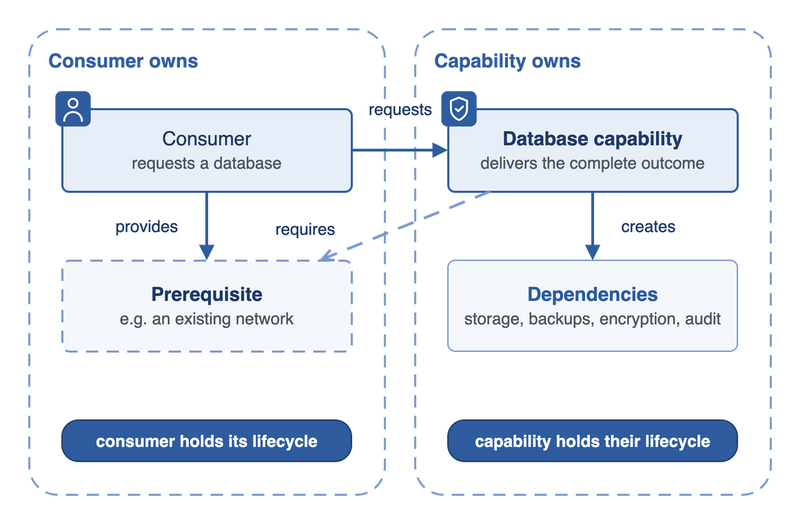
 
<figcaption align="center"><em>A prerequisite is provided by the consumer, who holds its lifecycle. A dependency is created by the capability, which holds its lifecycle.</em></figcaption>
</figure>
 

#### Conformance tests for Encapsulated Dependencies

A capability satisfies this factor when consumers describe their intended outcome in the vocabulary of the capability's domain rather than its implementation, and when nothing beyond submitting that declaration is required of them. Consumers do not directly interact with implementation tooling, sequence operations, trigger execution, connect outputs between components, or restructure state when the implementation changes.

The cost of failing this factor is that every fix, upgrade, or drift correction depends on each consumer taking action, so the platform cannot guarantee when, or whether, a change reaches every instance without tracking state, sequencing, and exceptions for each capability individually. Another form of failure is when the capability producer does not retain responsibility for its dependencies, and passes failures on to the consumer.

### Safe Reconciliation

*The same desired state can be applied repeatedly without side effects.*

Platforms often need to run retries, rollouts, recovery, and drift correction, and under those conditions the same request may be applied many times. A capability must converge on the same result each time, rather than duplicating resources, making unexpected changes, or leaving broken intermediate states. When the declared state is reapplied after drift, partial failure, a rollout, or a recovery, the capability moves toward the same outcome it reached the first time.

This is not the same property as declarative input, though the two are close and are easily confused. Declarative input concerns what the request says; safe reconciliation concerns what happens when that request is applied again. A contract can use perfectly declarative language and still fail this factor, if applying the same declaration twice creates two of something that should exist once.

The reason this matters is that platform operations become too costly if they must carry custom instructions for every capability about what to do next when something goes wrong. Networks fail, dependencies become unavailable, controllers restart, and configurations change. If reapplying a declaration is unsafe, the platform would not be able to support updates and upgrades safely across an entire catalog of capabilities.

Safe reconciliation also keeps ownership with the producer. When a capability can recover from drift and partial failure by reapplying the declared state, the consumer does not have to resubmit or repair anything by hand. The producer stays accountable for keeping each instance aligned with what was asked for, and that accountability covers the whole length of the instance's life, not just its first provisioning. As infrastructure evolves in ways that should be invisible to the consumer (e.g dependencies are updated, and requirements change), the producer continues to own the alignment between declared state and delivered outcome.

This property is what makes fleet-wide change possible. Producers need to roll out security fixes, updates, and rollbacks without turning each instance into a special case. Safe change across the installed base depends on the capability being able to apply the intended configuration consistently across many instances rather than needing to coordinate changes to one instance at a time.

<figure align="center">
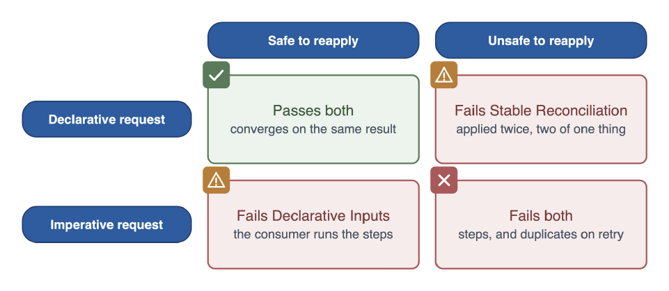
 
<figcaption align="center"><em>A declarative request that also reconciles safely passes both factors. Imperative requests, or declarative requests that duplicate resources on reapply, fail Declarative Inputs and/or Safe Reconciliation.</em></figcaption>
</figure>
 

#### Conformance test for Safe Reconciliation

A capability satisfies this factor when repeated application of the same declared state is trusted to reach a safe result, without duplicate resources, unexpected side effects, or manual repair, both for a single instance and across many instances during a managed change. Consumers may trigger reconciliation on their own resources at any time, but reconciliation should also be trusted when initiated by the platform or capability across one or more instances. Three common situations where this occurs include: when the same declaration is applied again, when an instance drifts from its declared state, and when the producer changes the implementation across all instances.

The cost of failing this factor is that the platform cannot provide basic remediation for issues or reduce cost by managing updates across instances of a capability without cumbersome state tracking, sequencing, or other guards against drift and unsafe changes for each capability individually.

### Operational Evidence

*The capability exposes authoritative details about ownership, state, lifecycle, and policy information.*

A capability must expose authoritative information that makes it and its instances discoverable, understandable, and operable throughout their lifecycle. That information includes who owns them, what they do, what state they are in, which policies apply, and what obligations follow from their usage. The evidence is authoritative in the strict sense: it is the source of truth, not one of several stale places a consumer might have to reconcile by hand, and not something inferred from implementation details or an ad hoc dashboard.

This evidence comes in two kinds, and both are required. Documentation answers what is supposed to be true: purpose, supported use, ownership, lifecycle status, support expectations, and policy requirements. Telemetry answers what is actually true: health, status, lifecycle stage, compliance state, recent changes, and audit-relevant events. Both are delivered through the capability's own interfaces to the observability system and the platform's shared infrastructure, packaged with the capability rather than left for consumers to reconstruct.

The evidence must serve every authorized actor, each of whom brings different questions including:

- Capability consumers can ask whether they can use the capability and what their obligations are.
- Platform operations and leadership can ask whether the capability is worth continued investment.
- Capability producers can ask whether the capability is healthy and who is consuming it.

In addition, capability producers may be asked to expose details to support additional, more specialized business/organization functions, for example:

- a finance function who asks what the organization is spending and who owns the cost
- a security and compliance function who asks whether the capability is in posture and where the active exceptions are

Each of these actors must be able to answer their own questions without privileged internal access and without the producer stepping in to help.

<figure align="center">
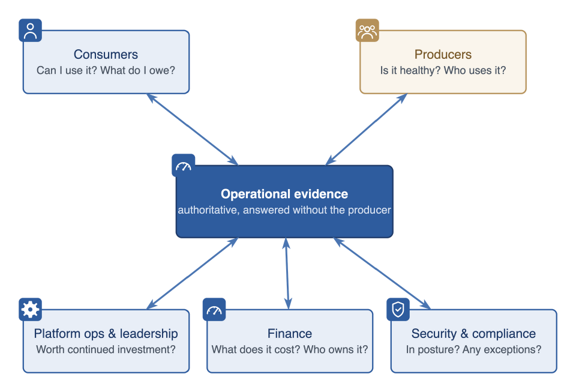
 
<figcaption align="center"><em>Consumers, producers, platform ops and leadership, finance, and security and compliance all draw on the same authoritative operational evidence to answer their own questions.</em></figcaption>
</figure>
 

Providing this evidence should enable questions to reach across the fleet, rather than stop at a single instance. However, it should not replace resource telemetry. Capabilities may create one or more provisioned resources which each have their own purpose built telemetry tools that should continue to be used.

This factor is what makes every other factor verifiable. A capability can satisfy the other four, but without authoritative evidence the platform cannot confirm that it does, cannot determine which policies apply or whether they are met, and cannot tell when drift or non-compliance calls for action. The more independently capabilities are produced, the more this matters, because the platform can rely less and less on knowing the producer personally.

#### Conformance test for Operational Evidence

A capability satisfies this factor when authorized actors can answer the questions relevant to their role, for a single instance and across all instances, from one authoritative source, without privileged internal access, producer involvement, or aggregating data from consumer-owned systems.

The cost of failing this factor is that the platform can neither govern nor diagnose the capability reliably, and consumers must fall back on producer support to understand their capability's health, status, governance posture, or accountability.

### Applying the Capability Factors

These factors define the properties that allow independently produced capabilities to participate safely in a shared platform marketplace. Together, they make explicit the trade-offs between keeping operational complexity within a capability's own boundaries and pushing avoidable cost onto consumers or the platform.

The conformance tests described at the bottom of each factor focus on observable behavior rather than implementation. The purpose of these factors is not to certify the quality of a capability or prescribe how it should be implemented. Instead, capabilities are evaluated without reference to their internal design, chosen tooling, or programming model. A platform may use the factors during capability onboarding, periodic reviews, or when diagnosing capabilities that prove difficult to operate.

The factors, and more broadly this paper, are intentionally independent of any particular platform technology. A capable platform framework provides useful primitives, and many make these factors easier to achieve through their contribution model and supporting tooling. But no framework can decide for an organization where ownership boundaries belong, what should be encapsulated, which dependencies are part of the product, or what operational evidence a capability must provide. Those are architectural decisions made by the capability producer as part of the platform's participation contract.

## Conclusion

When capabilities present a clear contract, accept declarative intent, encapsulate their implementation, reconcile safely over time, and expose authoritative operational evidence, specialist teams can contribute independently without fragmenting the platform. Platform operators gain a marketplace with a self-sustaining catalog they can govern consistently, consumers gain capabilities they can trust, and producers retain ownership of the domains they know best. The result is a platform that can continue to grow in capability, organizational reach, and operational maturity by distributing expertise across the organization rather than centralizing responsibility within a single team.

<figure align="center">
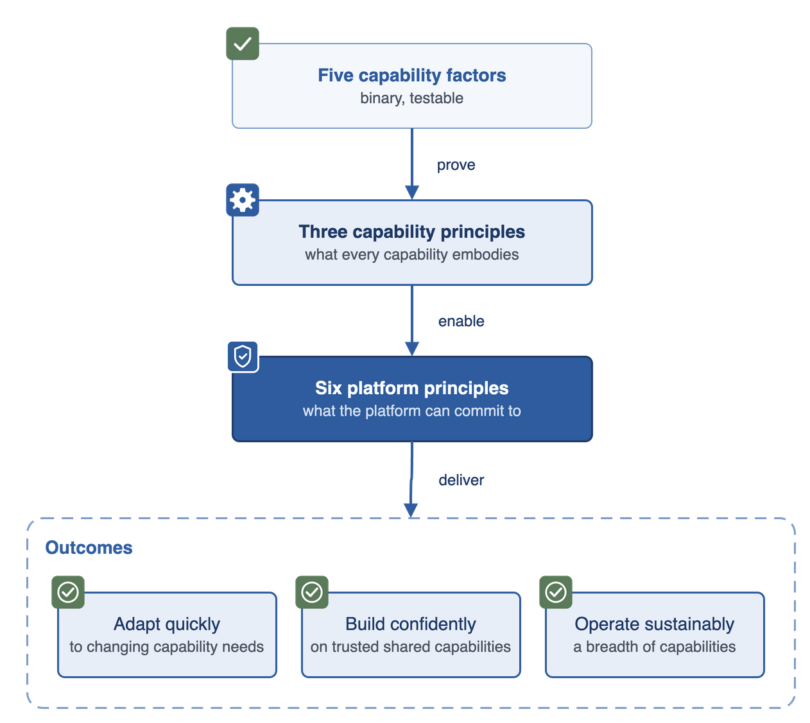
 
<figcaption align="center"><em>The five capability factors prove the three capability principles, which enable the six platform principles, which deliver an ecosystem that can adapt quickly, build confidently, and operate sustainably.</em></figcaption>
</figure>
 
